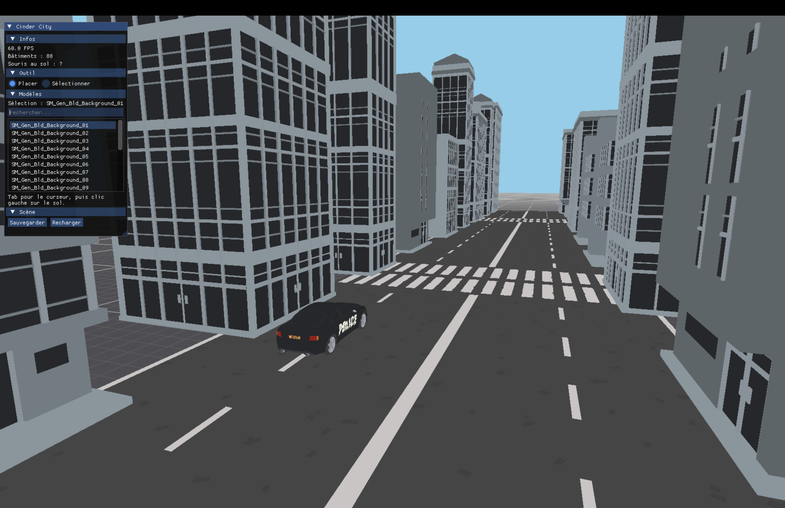
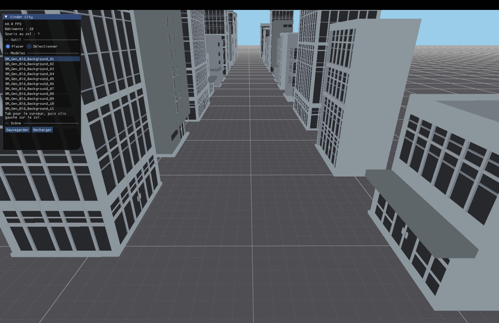

### *Un monde ouvert. Un développeur. Une obsession.*

Un jeu vidéo en monde ouvert urbain, construit intégralement à la main —
sans moteur du commerce, une ligne de code après l'autre.

<p align="center">
  
  <br>
  <sub><i>🚧 En cours de développement — dernier aperçu du moteur maison : l'avenue pavée (chaussée, passages piétons, véhicule de police), éditeur intégré à gauche. Historique complet dans la galerie, plus bas.</i></sub>
</p>


<!-- LOC:START -->


| Catégorie | Fichiers | Lignes |
|---|---:|---:|
| C++ (`src/`) | 40 | 2996 |
| Shaders (GLSL) | 6 | 148 |
| CMake | 1 | 137 |
| **Total** | **47** | **3281** |

<sub>Pour mettre à jour ce compteur, depuis la racine du dépôt :</sub>

```bash
python3 .github/scripts/update_loc.py
```
<!-- LOC:END -->


> *« Pas de moteur clé en main. Pas de raccourci.*
> *Juste du code, de la patience, et un monde à faire vivre. »*


## 🎮 Le projet

**Cinder City** est un jeu en monde ouvert : une ville d'un kilomètre carré,
vivante et entièrement explorable — véhicules, circulation, foule et systèmes
réactifs à grande échelle.

Le pari est assumé : **tout construire soi-même**. Chaque brique — fenêtrage,
rendu, physique, audio, IA des habitants — est écrite sur mesure. Pour un
contrôle total, des performances au plus près du métal, et un code taillé pour
durer.

## 🔥 Une aventure en solo

Cinder City est développé par **un seul développeur**, porté par une conviction
simple : un monde ouvert ambitieux peut naître d'un travail patient, rigoureux
et passionné. L'ambition est grande. L'approche est méthodique. La détermination
est totale.

C'est un projet au long cours — et il est mené comme tel.

## ✨ Vision

| | |
|---|---|
| 🗺️ **Monde ouvert** | 1 km × 1 km explorables, sans chargement apparent |
| 🚗 **Conduite libre** | Véhicules et déplacement au cœur de l'expérience |
| 🏙️ **Ville vivante** | Circulation, piétons et systèmes réactifs simulés en masse |
| ⚡ **Performance** | Architecture soignée et C++ moderne, pensés pour tenir dans le temps |


## 🛠️ Stack technique

Un socle **C++23 moderne**, sans moteur, assemblé autour de technologies
éprouvées et pérennes. `✅` = intégré · `🔜` = prévu.

| Domaine | Technologie | Rôle | Statut |
| --- | --- | --- | :---: |
| 🪟 Fenêtrage / entrées |  | Fenêtres et périphériques | ✅ |
| 🎨 Rendu 3D |  | Rendu moderne cross-platform (Metal / Vulkan / D3D12) | ✅ |
| 🧬 Shaders |  | Traduction SPIR-V → format natif au runtime | ✅ |
| 📐 Mathématiques |  | Algèbre linéaire 3D (matrices, quaternions) | ✅ |
| 📦 Import de modèles |  | Chargement des modèles FBX (mètres, Y-up, UV) | ✅ |
| 🖼️ Textures |  | Décodage PNG / TGA, cache par fichier, **une texture par modèle** | ✅ |
| 🌃 Émissif |  | Fenêtres et enseignes lumineuses (couleur + émissif additionnés) | ✅ |
| 🚗 Véhicules |  | Berline complète + **livrées par instance** (Taxi / Police / Coastguard) | ✅ |
| 🗺️ Scènes (données) |  | Ville décrite en données (`city.json`), hors du code | ✅ |
| 🧩 Entités |  | Modèle game object maison (transform · entity · world) | ✅ |
| 🧭 Éditeur in-game |  | Poser / sélectionner / éditer / sauver la ville à la souris | ✅ |
| 💥 Physique |  | Véhicules et collisions | 🔜 |
| 🔊 Audio |  | Spatialisation et mixage | 🔜 |
| 📊 Profilage |  | Analyse des performances en temps réel | 🔜 |


## 🧱 Architecture

Le moteur est découpé en modules à responsabilité unique :

```
src/engine/
├── core/     platform (SDL) · window · application · log
├── render/   graphics_device · shader · gpu_buffer · gpu_mesh · texture · renderer
├── assets/   fbx_loader (import FBX) · stb_image (PNG/TGA) · model_catalog · texture_catalog
├── scene/    camera (vol libre) · transform · scene_loader (city.json)
├── world/    world · entity · static_prop · ground
└── editor/   ui (Dear ImGui — éditeur de ville in-game)
```


**Du data au pixel.** Un objet est d'abord une géométrie (`mesh`, sommets +
indices), soit générée à la main (le sol), soit **importée d'un fichier FBX**
via `fbx_loader`. Elle est uploadée en VRAM sous forme de `gpu_mesh` — chargée
**une seule fois** par le `model_catalog` puis partagée par toutes ses instances.
Chaque géométrie est portée par une **entité** (un `transform`, une couleur, un
**matériau** et une **texture**) qui vit dans le **`world`**. Chaque frame, le
**`renderer`** parcourt le monde et dessine chaque entité en sélectionnant le
**pipeline correspondant à son matériau** : `solid_color` pour les objets unis,
`grid_floor` pour le sol quadrillé, et `textured` pour les modèles. Chaque modèle
utilise **sa propre texture** : le `model_catalog` relève l'atlas référencé dans
le FBX, le `texture_catalog` le charge **une seule fois** (recherche sous
`assets/Textures`, avec des alias de packs équivalents), et le renderer le lie —
repli sur une **palette globale** si le modèle n'en désigne aucune. Le pipeline
texturé lie **deux textures** : l'atlas de couleur et son **émissif** — le shader
les additionne (`base + lueur`), ce qui allume fenêtres et enseignes là où l'atlas
émissif en contient. Un interrupteur dans `textured.frag` coupe la lueur sans
toucher au C++.

**La ville en données, pas en code.** La disposition de la ville ne vit plus dans
le C++ : elle est décrite dans un fichier de scène **`city.json`** (une liste
d'instances `{ modèle, position, rotation, échelle }`) que le `scene_loader` lit
au démarrage pour peupler le monde. Ajouter ou déplacer un bâtiment se fait en
éditant ce fichier — **sans recompiler**. C'est la fondation du futur éditeur.

```json
{ "model": "SM_Gen_Bld_Background_01", "position": [10, 0, 0], "rotation_y": 90, "scale": 1.0 }
```

La scène actuelle en est la preuve : l'**avenue de démonstration** — deux rangées
de façades face à face, une **chaussée pavée** (dalles de route + passages piétons)
et quelques **véhicules** — est **entièrement générée en données** dans `city.json`,
zéro ligne de C++.

**Variantes par instance.** Une instance peut porter un champ optionnel `variant`
qui change son apparence sans dupliquer le modèle. Pour les véhicules, il choisit
la **livrée** (lettre de l'atlas Synty : `A` Taxi, `B` Police, `C` Coastguard) —
même géométrie, texture différente :

```json
{ "model": "SM_Veh_Sedan_01", "position": [-10, 0, -5], "rotation_y": 90, "variant": "B" }
```

**Modèle d'entités (OOP).** Une classe de base `entity` (transform, mesh, couleur,
matériau, texture, `update()`) se spécialise par héritage : `static_prop` (immobile),
bientôt `vehicle`, `pedestrian`… Ajouter un objet au monde tient en une ligne :

```cpp
world_.spawn<static_prop>(catalog_.get("SM_Gen_Bld_Background_01"),
                          transform {.position = {10, 0, 0}},
                          glm::vec4 {1.0f}, material_type::textured);
```

**Éditeur de ville in-game.** On se déplace dans la scène avec une **caméra libre**
(vol au clavier + souris), et on bâtit la ville **directement à la souris** grâce à
une couche **Dear ImGui**. Le picking (rayon curseur → sol) permet de **poser** un
modèle au clic, de **sélectionner** un bâtiment existant, puis de le **déplacer,
tourner, redimensionner ou supprimer** — le tout **sauvegardé** dans `city.json`.
`Tab` bascule entre pilotage caméra et interaction avec l'interface. Le panneau
est organisé en **sections repliables** (Infos · Outil · Modèles · Sélection ·
Scène), avec une **barre de recherche** qui filtre la palette de modèles en direct
et une liste défilante — prêt pour des centaines de modèles. Quand un **véhicule**
est sélectionné, un menu **Livrée** (Taxi / Police / Coastguard) apparaît et
s'applique à la pose suivante.

**Principes de code.** RAII systématique (chaque ressource GPU possédée et
libérée par un objet), C++23 (concepts, `std::format`, designated initializers),
séparation nette entre données (`city.json`), simulation (`world` / `entity`) et
rendu (`renderer`). Le code est **intégralement commenté en français** dans une
optique pédagogique — pour rester maintenable, relisible et prêt au multijoueur.


## 📁 Organisation du dépôt

```
cinder-city/
├── src/engine/          le moteur (voir Architecture ci-dessus)
├── shaders/             GLSL source + SPIR-V compilés (.spv)
├── assets/              ⚠ gitignoré — contenus propriétaires (voir ci-dessous)
│   ├── Models/          .fbx triés par catégorie (Buildings, Props, Vehicles…)
│   ├── Textures/        atlas & textures triés (Alts, Emissive, Buildings…)
│   ├── Collision/       meshes de collision (physique, plus tard)
│   └── city.json        la scène — seule donnée versionnée de ce dossier
├── docs/screenshots/    captures datées (AAAA-MM-JJ_description.png)
└── .github/scripts/     outillage (compteur de lignes du README)
```

**Assets propriétaires.** Les modèles et textures proviennent des packs
**Synty POLYGON** (Palm City / Generic), sous licence commerciale : ils ne sont
**pas inclus** dans le dépôt (`assets/` est gitignoré, seule `city.json` est
versionnée). Pour lancer le jeu, il faut posséder ces packs et déposer leurs
`SourceFiles` dans `assets/` — les modèles sont ensuite triés par catégorie et
référencés **par nom** dans `city.json`, jamais par chemin en dur dans le code.


## 🚧 Feuille de route

| | Étape | Statut |
| --- | --- | --- |
| ✅ | Socle moteur — fenêtre, boucle applicative, logs | Fait |
| ✅ | Rendu SDL_gpu — device, pipeline, depth buffer | Fait |
| ✅ | Sol 1 km² + caméra perspective | Fait |
| ✅ | Architecture entité/monde (game object OOP) | Fait |
| ✅ | Matériaux par entité — `solid_color` / `grid_floor` | Fait |
| ✅ | Import de modèles FBX (ufbx) + rendu texturé (palette Synty) | Fait |
| ✅ | Ville en données — `city.json` + catalogue de modèles | Fait |
| ✅ | Caméra libre — vol clavier (ZQSD) + souris | Fait |
| ✅ | Intégration Dear ImGui (overlay debug, rendu en 2ᵉ passe) | Fait |
| ✅ | Base de code intégralement commentée (français, pédagogique) | Fait |
| ✅ | Picking souris (rayon curseur → sol) | Fait |
| ✅ | Éditeur in-game — poser / sélectionner / éditer / sauver la ville | Fait |
| ✅ | Assets triés par catégorie + tri des modèles 100 % texturables | Fait |
| ✅ | Rendu émissif — fenêtres/enseignes lumineuses (2 textures additionnées) | Fait |
| ✅ | Éditeur organisé — sections repliables, recherche, panneau ancré | Fait |
| ✅ | Texture par modèle (résolue du FBX) + cache `texture_catalog` + alias de packs | Fait |
| ✅ | Avenue pavée — chaussée + passages piétons, générés en données | Fait |
| ✅ | Véhicules — berline + livrées par instance (Taxi / Police / Coastguard) | Fait |
| ⬜ | Multi-matériaux par sous-mesh — vitres/carrosserie distinctes, vraies couleurs | À venir |
| ⬜ | Véhicules articulés — garder l'arbre FBX : roues qui tournent, portes qui s'ouvrent | À venir |
| ⬜ | Surlignage de la sélection dans l'éditeur | À venir |
| ⬜ | Peupler la ville — circulation, PNJ | À venir |
| ⬜ | Physique & collisions (Jolt) | À venir |

**Prochaine étape :** 🎨 Le rendu multi-matériaux — qui débloque à la fois les
vitres correctes, les vraies couleurs de carrosserie, et les véhicules articulés.

```
Progression du socle   [■■■■■■■■▌□]  85%
```


## 📸 Galerie

L'évolution du moteur, capture après capture — la plus récente en premier.

<!-- GALLERY:START -->
<table>
  <tr><td align="center" width="50%"><a href="docs/screenshots/2026-07-22_avenue-pavee-police.png"></a><br><sub><b>2026-07-22</b> — Avenue pavee police</sub></td><td align="center" width="50%"><a href="docs/screenshots/2026-07-21_avenue.png"></a><br><sub><b>2026-07-21</b> — Avenue</sub></td></tr>
</table>
<!-- GALLERY:END -->

<sub>Grille régénérée depuis <code>docs/screenshots/</code> via <code>python3 .github/scripts/update_gallery.py</code> (nommer les fichiers <code>AAAA-MM-JJ_description.png</code>).</sub>


## ⚙️ Construction

**Prérequis**

- Un compilateur **C++23** (Clang 17+, GCC 14+, MSVC 19.4+)
- **CMake ≥ 3.28**
- **`glslc`** pour compiler les shaders (paquet `shaderc`) — sur macOS : `brew install shaderc`

SDL3, GLM, SDL_shadercross, ufbx, stb_image, nlohmann/json et **Dear ImGui**
sont récupérés et compilés automatiquement par CMake (`FetchContent`, versions
épinglées).

**Compiler les shaders** (GLSL → SPIR-V), puis le projet :

```bash
for s in shaders/*.vert shaders/*.frag; do glslc "$s" -o "$s.spv"; done

cmake -S . -B build
cmake --build build -j
```

> ⚠ À refaire après **chaque modification d'un shader** : le moteur charge les
> `.spv`, pas les sources GLSL. Un `.spv` désynchronisé provoque une erreur de
> binding au lancement.

Lance l'exécutable **depuis la racine du projet** — les shaders `.spv` ainsi que
la scène, les modèles et les textures du dossier `assets/` y sont cherchés au
chargement. Sans les packs Synty dans `assets/` (voir plus haut), le programme
s'arrête au chargement de la palette.

**Contrôles**

- Au lancement, la caméra démarre **en haut de l'avenue**, en vue plongeante,
  prête à descendre la rue.
- **Navigation (mode vol) :** `ZQSD` pour se déplacer (scancodes physiques —
  fonctionne aussi en WASD sur QWERTY), la souris pour regarder,
  `Espace` / `Shift` pour monter / descendre.
- **`Tab`** : bascule entre pilotage caméra et interaction avec l'interface
  (en mode vol, la souris est capturée et l'UI ne reçoit aucun clic).
- **Éditeur (mode curseur) :** outil *Placer* → clic gauche pour poser le modèle
  choisi (filtrable via la barre de recherche) ; outil *Sélectionner* → clic sur
  un bâtiment pour l'éditer (déplacer, tourner, redimensionner, supprimer), puis
  *Sauvegarder* — *Recharger* annule les modifications non sauvées.
- **`Échap`** : quitter.


## 📜 Licence

Copyright © 2026 **PanDiMou** — **Tous droits réservés.**

Le code source est consultable publiquement à titre de référence uniquement.
Toute utilisation, copie, modification, compilation ou redistribution est
interdite sans autorisation écrite préalable. Voir [`LICENSE`](LICENSE) pour les
termes complets.


*Cinder City — bâtie une ligne à la fois.* 🌆
