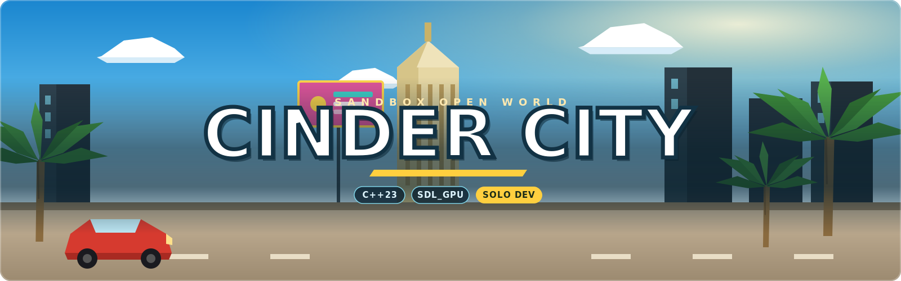
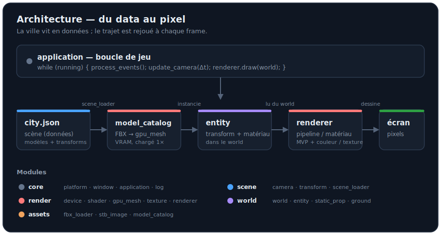

### *Un monde ouvert. Un développeur. Une obsession.*

Un jeu vidéo en monde ouvert urbain, construit intégralement à la main —
sans moteur du commerce, une ligne de code après l'autre.


> *« Pas de moteur clé en main. Pas de raccourci.*
> *Juste du code, de la patience, et un monde à faire vivre. »*


## 🎮 Le projet

**Cinder City** est un jeu en monde ouvert : une ville d'un kilomètre carré,
vivante et entièrement explorable — véhicules, circulation, foule et systèmes
réactifs à grande échelle.

Le pari est assumé : **tout construire soi-même**. Chaque brique — fenêtrage,
rendu, physique, audio, IA des habitants — est écrite sur mesure. Pour un
contrôle total, des performances au plus près du métal, et un code taillé pour
durer.

## 🔥 Une aventure en solo

Cinder City est développé par **un seul développeur**, porté par une conviction
simple : un monde ouvert ambitieux peut naître d'un travail patient, rigoureux
et passionné. L'ambition est grande. L'approche est méthodique. La détermination
est totale.

C'est un projet au long cours — et il est mené comme tel.

## ✨ Vision

| | |
|---|---|
| 🗺️ **Monde ouvert** | 1 km × 1 km explorables, sans chargement apparent |
| 🚗 **Conduite libre** | Véhicules et déplacement au cœur de l'expérience |
| 🏙️ **Ville vivante** | Circulation, piétons et systèmes réactifs simulés en masse |
| ⚡ **Performance** | Architecture soignée et C++ moderne, pensés pour tenir dans le temps |


## 🛠️ Stack technique

Un socle **C++23 moderne**, sans moteur, assemblé autour de technologies
éprouvées et pérennes. `✅` = intégré · `🔜` = prévu.

| Domaine | Technologie | Rôle | Statut |
| --- | --- | --- | :---: |
| 🪟 Fenêtrage / entrées |  | Fenêtres et périphériques | ✅ |
| 🎨 Rendu 3D |  | Rendu moderne cross-platform (Metal / Vulkan / D3D12) | ✅ |
| 🧬 Shaders |  | Traduction SPIR-V → format natif au runtime | ✅ |
| 📐 Mathématiques |  | Algèbre linéaire 3D (matrices, quaternions) | ✅ |
| 📦 Import de modèles |  | Chargement des modèles FBX (mètres, Y-up, UV) | ✅ |
| 🖼️ Textures |  | Décodage des images (PNG) vers la VRAM | ✅ |
| 🗺️ Scènes (données) |  | Ville décrite en données (`city.json`), hors du code | ✅ |
| 🧩 Entités |  | Modèle game object maison (transform · entity · world) | ✅ |
| 🧭 Éditeur in-game |  | Poser la ville à la souris, sauver la scène | 🔜 |
| 💥 Physique |  | Véhicules et collisions | 🔜 |
| 🔊 Audio |  | Spatialisation et mixage | 🔜 |
| 📊 Profilage |  | Analyse des performances en temps réel | 🔜 |


## 🧱 Architecture

Le moteur est découpé en modules à responsabilité unique :

```
src/engine/
├── core/     platform (SDL) · window · application · log
├── render/   graphics_device · shader · gpu_buffer · gpu_mesh · texture · renderer
├── assets/   fbx_loader (import FBX) · stb_image (décodage PNG) · model_catalog
├── scene/    camera (vol libre) · transform · scene_loader (city.json)
└── world/    world · entity · static_prop · ground
```



**Du data au pixel.** Un objet est d'abord une géométrie (`mesh`, sommets +
indices), soit générée à la main (le sol), soit **importée d'un fichier FBX**
via `fbx_loader`. Elle est uploadée en VRAM sous forme de `gpu_mesh` — chargée
**une seule fois** par le `model_catalog` puis partagée par toutes ses instances.
Chaque géométrie est portée par une **entité** (un `transform`, une couleur et un
**matériau**) qui vit dans le **`world`**. Chaque frame, le **`renderer`**
parcourt le monde et dessine chaque entité en sélectionnant le **pipeline
correspondant à son matériau** : `solid_color` pour les objets unis, `grid_floor`
pour le sol quadrillé, et `textured` pour les modèles échantillonnés dans une
**palette** (texture Synty).

**La ville en données, pas en code.** La disposition de la ville ne vit plus dans
le C++ : elle est décrite dans un fichier de scène **`city.json`** (une liste
d'instances `{ modèle, position, rotation, échelle }`) que le `scene_loader` lit
au démarrage pour peupler le monde. Ajouter ou déplacer un bâtiment se fait en
éditant ce fichier — **sans recompiler**. C'est la fondation du futur éditeur.

```json
{ "model": "SM_Bld_Beach_Shop_01", "position": [10, 0, 0], "rotation_y": 90 }
```

**Modèle d'entités (OOP).** Une classe de base `entity` (transform, mesh, couleur,
matériau, `update()`) se spécialise par héritage : `static_prop` (immobile),
bientôt `vehicle`, `pedestrian`… Ajouter un objet au monde tient en une ligne :

```cpp
world_.spawn<static_prop>(catalog_.get("SM_Bld_Beach_Shop_01"),
                          transform {.position = {10, 0, 0}},
                          glm::vec4 {1.0f}, material_type::textured);
```

**Principes de code.** RAII systématique (chaque ressource GPU possédée et
libérée par un objet), C++23 (concepts, `std::format`, designated initializers),
séparation nette entre données (`city.json`), simulation (`world` / `entity`) et
rendu (`renderer`) — pour rester maintenable et prêt au multijoueur.


## 🚧 Feuille de route

| | Étape | Statut |
| --- | --- | --- |
| ✅ | Socle moteur — fenêtre, boucle applicative, logs | Fait |
| ✅ | Rendu SDL_gpu — device, pipeline, depth buffer | Fait |
| ✅ | Sol 1 km² + caméra perspective | Fait |
| ✅ | Architecture entité/monde (game object OOP) | Fait |
| ✅ | Matériaux par entité — `solid_color` / `grid_floor` | Fait |
| ✅ | Import de modèles FBX (ufbx) + rendu texturé (palette Synty) | Fait |
| ✅ | Ville en données — `city.json` + catalogue de modèles | Fait |
| ✅ | Caméra libre — vol clavier (ZQSD) + souris | Fait |
| 🟨 | Éditeur in-game (ImGui) — poser / déplacer / sauver la ville | En cours |
| ⬜ | Peupler la ville — bâtiments, véhicules, PNJ | À venir |
| ⬜ | Physique & collisions (Jolt) | À venir |

**Prochaine étape :** 🧭 Un éditeur intégré pour composer la ville à la souris.

```
Progression du socle   [■■■■■■□□□□]  60%
```


## ⚙️ Construction

**Prérequis**

- Un compilateur **C++23** (Clang 17+, GCC 14+, MSVC 19.4+)
- **CMake ≥ 3.28**
- **`glslc`** pour compiler les shaders (paquet `shaderc`) — sur macOS : `brew install shaderc`

SDL3, GLM, SDL_shadercross, ufbx, stb_image et nlohmann/json sont récupérés et
compilés automatiquement par CMake.

**Compiler les shaders** (GLSL → SPIR-V), puis le projet :

```bash
glslc shaders/solid_color.vert -o shaders/solid_color.vert.spv
glslc shaders/solid_color.frag -o shaders/solid_color.frag.spv
glslc shaders/grid_floor.vert  -o shaders/grid_floor.vert.spv
glslc shaders/grid_floor.frag  -o shaders/grid_floor.frag.spv
glslc shaders/textured.vert    -o shaders/textured.vert.spv
glslc shaders/textured.frag    -o shaders/textured.frag.spv

cmake -S . -B build
cmake --build build -j
```

Lance l'exécutable **depuis la racine du projet** — les shaders `.spv` ainsi que
la scène, les modèles et les textures du dossier `assets/` y sont cherchés au
chargement.

**Contrôles (caméra libre) :** `ZQSD` pour se déplacer, la souris pour regarder,
`Espace` / `Shift` pour monter / descendre, `Échap` pour quitter.


## 📜 Licence

Copyright © 2026 **PanDiMou** — **Tous droits réservés.**

Le code source est consultable publiquement à titre de référence uniquement.
Toute utilisation, copie, modification, compilation ou redistribution est
interdite sans autorisation écrite préalable. Voir [`LICENSE`](LICENSE) pour les
termes complets.


*Cinder City — bâtie une ligne à la fois.* 🌆
